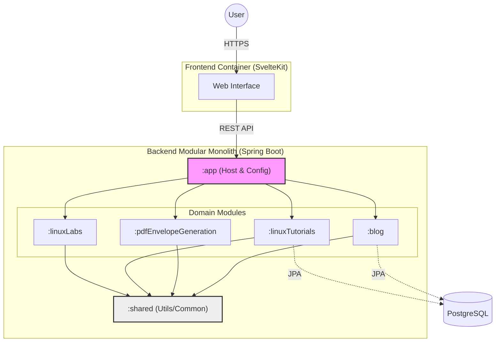

# CodeByMe.de - Tech Blog

A tech blog, Linux tutorials, interactive labs, and PDF generation tools.

## Architecture Overview

This project uses a **Monorepo** structure to house both the Backend and Frontend, ensuring atomic commits and synchronized deployments.

### Tech Stack

| Component | Technology | Version | Description |
| :--- | :--- | :--- | :--- |
| **Backend** | **Spring Boot** | 4.0.0 | Core API, Business Logic, Kafka Consumers. |
| **Language** | **Java** | 25 (LTS) | Using latest language features. |
| **Build Tool** | **Gradle** | 9.x | Multi-module build (`app` + `shared`). |
| **Frontend** | **SvelteKit** | 2.0 | SSR, Reactive UI, Linux Terminal simulation. |
| **Runtime** | **Node.js** | 20 | Runs the SvelteKit Adapter-Node server. |
| **Database** | **PostgreSQL** | 16 | Relational data persistence. |
| **Message Broker** | **Apache Kafka** | 3.7 | Real-time event streaming for Linux Labs. |

### Network & Deployment Topology

  * **Reverse Proxy:** Apache HTTP Server (Host) handles SSL termination and routing.
      * `/api` → Proxies to Spring Boot Backend (`127.0.0.1:8083`).
      * `/` → Proxies to SvelteKit Frontend (`127.0.0.1:8082`).
  * **Containerization:** Both applications run in optimized Docker containers on a custom internal bridge network.
  * **CI/CD:** Automated pipeline via **GitLab CI** deploying to an **AlmaLinux 9.5** server.

-----

## DevOps & CI/CD Pipeline

The project follows a **GitOps** workflow. Code is pushed to GitHub, mirrored to GitLab, and automatically deployed to production.

### The Pipeline Flow

1.  **Merge to main:** after merging to the `main` branch on GitHub.
2.  **Mirroring:** Code is instantly synced to GitLab.
3.  **Test Stage:**
      * Runs JUnit 5 tests for Backend (in `gradle:jdk25` container).
      * Runs ESLint/Prettier/Check for Frontend (in `node:20-alpine` container).
4.  **Build Stage:**
      * Builds Docker images using **Multi-Stage Builds**.
      * Pushes images to **GitLab Container Registry**.
5.  **Deploy Stage:**
      * Connects to Production Server via SSH.
      * Generates a dynamic `docker-compose.yml` with versioned image tags.
      * Pulls new images and performs a zero-downtime container replacement.

### Infrastructure Configuration

  * **CI Configuration:** [`codebyme.de/.gitlab-ci.yml`](.gitlab-ci.yml) - Defines the Test -\> Build -\> Deploy stages.
  * **Production Compose:** [`codebyme.de/docker-compose.prod.yml`](docker-compose.prod.yml) - Service definition for the production environment.

### Docker Configuration

Multi-stage Dockerfiles to ensure lightweight production images (stripping out build tools like Gradle and npm).

  * **Backend Dockerfile:** [`backend/Dockerfile`](backend/Dockerfile) - Builds Spring Boot Fat Jar.
  * **Frontend Dockerfile:** [`frontend/Dockerfile`](frontend/Dockerfile) - Builds SvelteKit Node Adapter.

-----

## Local Development

### Prerequisites

  * Java 25 SDK
  * Node.js 24.11+
  * Gradle 9.1.0
  * Docker & Docker Compose
  * PostgreSQL 17.4

## Key Features (Implemented & Planned)

### Implemented

  * **Multi-Module Gradle Build:** Separation of `app` (API) and `shared` (Library) modules.
  * **Full-Stack Proxying:** Seamless local dev environment without CORS issues.
  * **Automated Deployment:** Push-to-Deploy pipeline active.

### In Progress

  * **Linux Labs:** Interactive xterm.js terminal connected to Docker containers via WebSockets.
  * **PDF Generator:** DHL-compliant envelope generation using `@react-pdf` logic ported to Svelte.
  * **Kafka Integration:** Real-time event streaming for user activity and lab status.

-----

## Feedback

I'd be happy for some feedback about the project structure, tech choices, or any other aspect!

