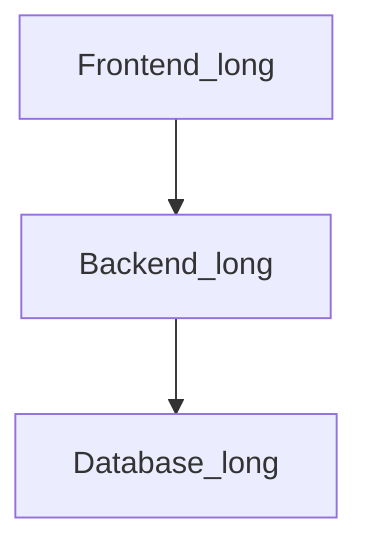

# title

## subtitle

```java
public class Test {
    public static void main(String[] args) {
        System.out.println("Hello World");
    }
}
```



> This is a quote.


```html
<button>Click me</button> ``
```
